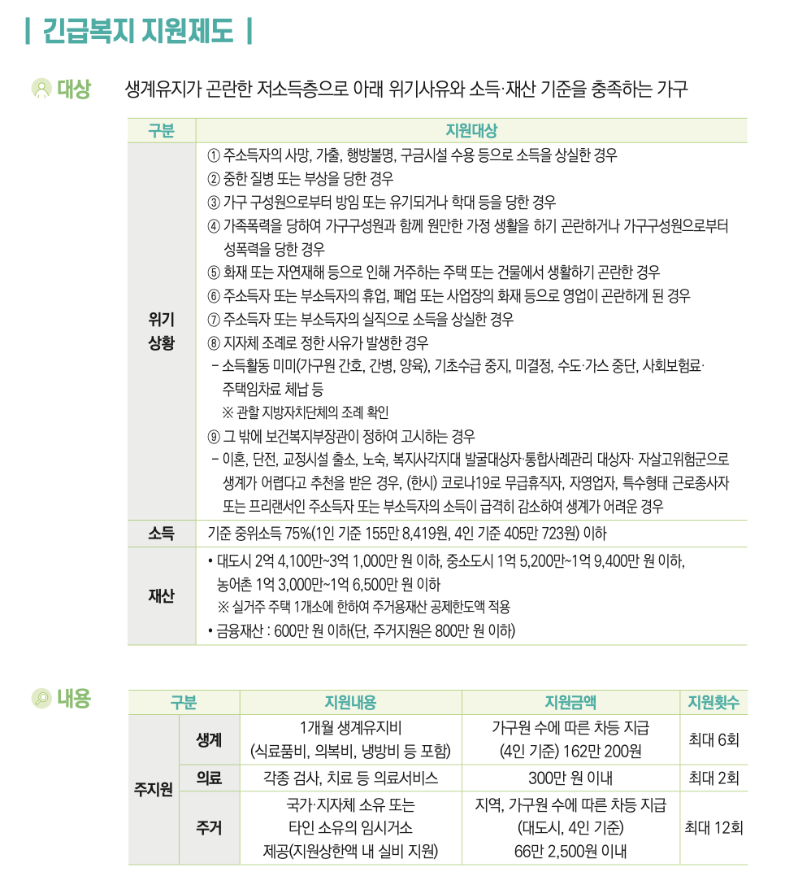
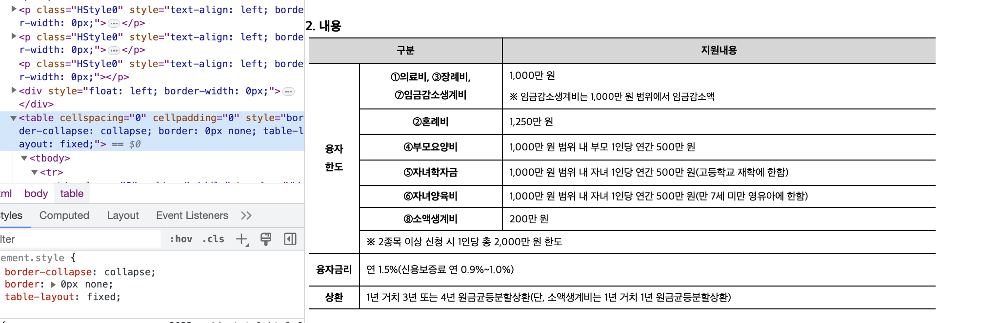

## Task
- 보건복지부 2023 나에게 힘이 되는 복지 서비스 문서에 대한 QA 챗봇 개발

[Figure1] 나에게 힘이 되는 복지 서비스 문서 예시

## Data 
1. 정형화 (대상 내용 방법 문의라는 일정한 구조)
2. html로 export 가능
   
3. 다수의 table 데이터 포함 (KorQuAD 활용 가능 html 방식의 QA 데이터셋)
4. 400 페이지로 closed domain QA 라고 볼 수 있음

## Problem Formulation
1. 적은 Hallucinations 요구
2. 채팅 방식으로 구현해야함 (단순한 답변 X)
3. 한국어 Retrieval 한국어 Generation (흠...)
4. table 형태의 데이터가 처리 가능해야함

## Related works
1. Retrieval : 검색
	- TF-IDF
	- BM25
	- DPR
2. Retrieval Augmented Question Answering 
	(1) REPLUG : Black box ML에 적용 가능
		- DPR로 retrieve 이후 top K docs를 독립적으로 LM에 투입
		- 결과 도출
	(2) REALM : retriever 와 LM 한 번에 pretrain
	(3) RAG : Generation으로 확장 
		- Encoder Decoder 구조로 만들어서 Generation으로 변환
3. Chat
	- ?

## Appoach
- 일단 Generator를 학습시킬 상황은 안 되기 때문에,,, REPLUG 방법론을 최대한 유사하게 진행할 예정
- Table 형태의 데이터 Knowledge Graph를 형성하기 적절한 구조 --> Generality를 좀 잃을 것 같음
	- 아니면 DPR~
- 신경망 기반의 retriever를 학습시킬지 / 오픈된 모델을 사용할지 (단, 한국어도 잘하고 table 형태의 데이터도 잘 반영한 모델 찾을 수 있을지 살짝 의아하긴 함)
- 지금 너무 task specific한 모델을 만들고 있지는 않은지
- 데이터 증강-! 

